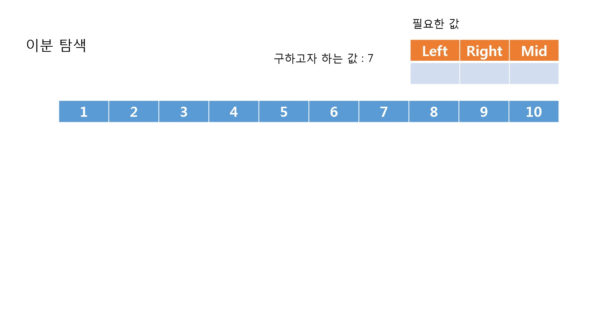

## 이분탐색
원하는 탐색범위를 두 부분으로 분할해 찾는 방식
시간복잡도는 O(n) 에서 O(log(n))으로 줄어든다



### 알고리즘
1. 배열을 정렬시켜놓는다
2. left, right 로 미드값을 잡아준다 mid = (left+right)/2
3. mid 값과 구하고자 하는 값을 비교
4. mid값보다 구하고자하는 값이 높으면 left를 mid+1로 만들어주고 아니면 right를 mid-1로 만들어준다
5. left > right 가 될 때까지 1~4를 반복한다

### 코드
```
int findN;
int result = 0;
//처음int는 다음 정점 마지막 int 값어치

int A[10] = { 1, 2, 3, 4, 5, 6, 7, 8, 9, 15 };

scanf("%d", &findN);
int left = 0, right =  9;


while (left <= right){

    int mid = (left + right) / 2;
    if (A[mid] > findN)
        right = mid - 1;
    else if (A[mid] < findN)
        left = mid + 1;
    else
    {
        result = mid;
        break;
    }

}
```
